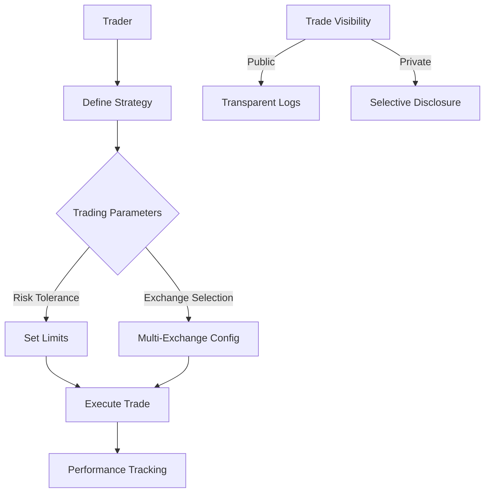

# Arbitrage Cascade

A decentralized multi-exchange arbitrage trading platform on the Stacks blockchain. Arbitrage Cascade enables sophisticated, on-chain trading strategies that leverage price discrepancies across different cryptocurrency exchanges.

## Overview

Arbitrage Cascade is designed to provide traders with a transparent, secure, and programmable way to execute cross-exchange arbitrage trades. The platform allows users to:

- Create complex, multi-step arbitrage trading strategies
- Execute trades across multiple exchanges
- Manage risk and reward parameters
- Track trading performance
- Maintain an immutable record of trading activities

## Architecture

The Arbitrage Cascade platform is built on a single core smart contract that manages arbitrage trading functionality.



### Core Components

1. **Strategy Management**
    - Multi-step trade configuration
    - Exchange route planning
    - Risk parameter definition
    - Performance tracking

2. **Trading Execution**
    - Cross-exchange trade routing
    - Real-time price comparison
    - Automated trade execution
    - Fail-safe mechanisms

3. **Performance System**
    - Trade result logging
    - Profit/loss calculation
    - Historical performance analysis
    - Compliance tracking

## Contract Documentation

### arbitrage-cascade.clar

The main contract handling arbitrage trading functionality.

#### Key Features

- Complex trading strategy definition
- Multi-exchange trade execution
- Risk management
- Performance tracking
- Transparent trading records

#### Access Control

- Traders can:
  - Define trading strategies
  - Execute trades
  - Monitor performance
- Platform can:
  - Validate trade parameters
  - Enforce risk constraints
- Public can:
  - View public trading logs

## Getting Started

### Prerequisites

- Clarinet
- Stacks wallet
- Multi-exchange API access

### Installation

1. Clone the repository
2. Install dependencies with Clarinet
3. Configure exchange connections
4. Deploy contracts to the desired network

### Basic Usage

```clarity
;; Create an arbitrage trading strategy
(contract-call? .arbitrage-cascade define-strategy 
  "BTC Cross-Exchange" 
  (list 
    { exchange: "exchange-a", action: "buy", amount: u1000 }
    { exchange: "exchange-b", action: "sell", amount: u1000 }
  )
  u100 ;; Max slippage
  u500 ;; Minimum profit threshold
)

;; Execute trading strategy
(contract-call? .arbitrage-cascade execute-strategy u1)

;; Check strategy performance
(contract-call? .arbitrage-cascade get-strategy-performance u1)
```

## Function Reference

### Strategy Management

```clarity
(define-strategy 
  (name (string-ascii 100)) 
  (trade-steps (list 5 TradeStep)) 
  (max-slippage uint) 
  (min-profit uint))
            
(update-strategy-parameters 
  (strategy-id uint) 
  (max-slippage uint) 
  (min-profit uint))

(execute-strategy (strategy-id uint))
```

### Performance Tracking

```clarity
(get-strategy-performance (strategy-id uint))
(log-trade-result (strategy-id uint) (profit-loss int))
```

### Risk Management

```clarity
(set-global-risk-parameters 
  (max-daily-trade-volume uint) 
  (max-single-trade-risk uint))
```

## Development

### Testing

1. Run the test suite:
```bash
clarinet test
```

2. Deploy to testnet:
```bash
clarinet deploy --testnet
```

### Local Development

1. Start Clarinet console:
```bash
clarinet console
```

2. Deploy contracts:
```bash
(contract-call? .arbitrage-cascade ...)
```

## Security Considerations

### Limitations

- Cross-exchange trade execution depends on external API reliability
- Real-time price synchronization challenges
- Potential network latency impacts

### Best Practices

1. Always validate trade parameters
2. Set conservative risk limits
3. Monitor market volatility
4. Use fail-safe mechanisms
5. Keep trading strategies modular

### Data Security

- Trading strategies are immutable once committed
- Performance logs are permanent
- Selective disclosure of trading activities
- Robust access control mechanisms